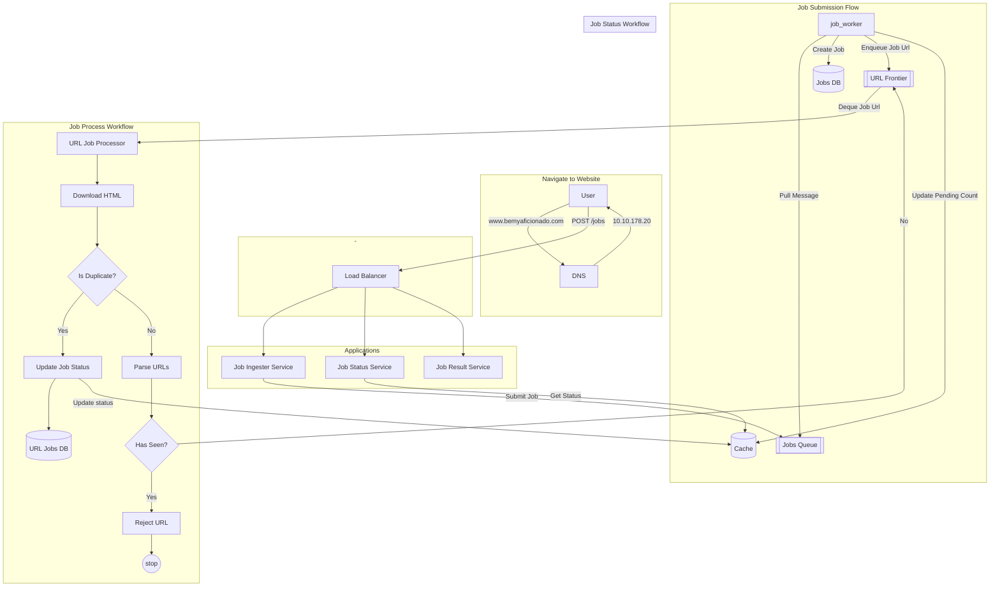
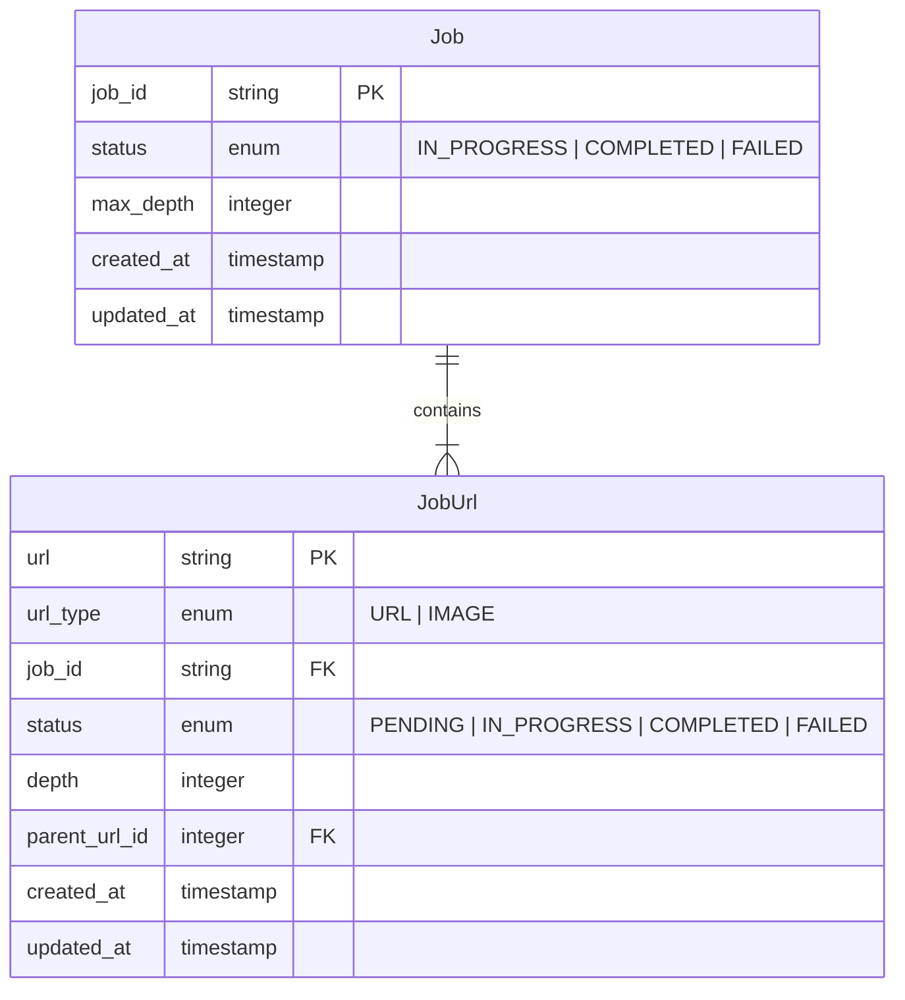

# Problem

Design a service which receives as input a list of URLs, scrapes those URLs for links to other pages and references to 
images (i.e. the src component of img tags), then returns a mapping of page URLs to a list of image URLs.

Your service does not need to download and store the images.

Your service should follow links to other pages from the original submitted pages, and return the images on those 2/3/nth 
level pages as if they were on the first level page.

The API contract is defined as:

POSTing to `/jobs` with a body of a JSON array of URLs to start scraping from 
(e.g. ["https://google.com", "https://www.statuspage.io"]) should return a job identifier of some kind,

- **GETing /jobs/:job_id/status** with the returned job identifier should return a JSON object of the format of 
```{"completed": x, "in_progress": y}``` where x is the number of original URLs which have been completely crawled 
and y is the number of original URLs which are still being crawled.

- **GETing /jobs/:job_id/results** with the returned job identifier should return a JSON object returning 
a mapping of original URL to all reachable images from that original URL, in the format of:

```json
{
    "https://google.com": [
      "https://google.com/images/logo_sm_2.gif",
      "https://google.com/images/warning.gif"
    ],
    "https://www.statuspage.io": [
      "https://statuspage.io/logo.png",
      "https://statuspage.io/other-logo.png"
    ]
}
```

# Non-Functional Requirements

- The application should support 1 Billion requests per day
- Each may contain average of 10 urls to scrap with 5 level depth
- Each page contains average of 5 urls
- QPS per day = 1 Billion / 24 / 3600 = 12400 QPS Approx.

# High Level Architecture Design



Let's expand on the database structure 


Here Jobs DB will be used to provide the status of the current job at that instance. 
The status will be updated based on the JobUrls.

To find if the job is still in progress, we could use following query. If the count is greater than 0 for the given Job ID.

```sql
SELECT count(status) FROM job_urls
WHERE status = 'PENDING' 
AND job_id = ?
```

But this database can become the bottleneck if we query this db for every request. There should be a way to provide this instantly.
Whenever we need immediate result, we should think about **CACHE**. 
So, the questions is how can we use cache here?

## Caching for job status

We have a unique identifier to begin with and that is "Job ID".
Therefore, if we could maintain the count for each status then based on the count we can identify of the job has completed or not.
And each worker can update this cache once they are done processing their own url.

For example:

Let's says user provides us with 2 urls to begin with:

- www.varunshrivastava.in
- www.bemyaficionado.com

The job will be created in the database and a unique job id will be generated.
The urls will be enqueued in the URL Frontier and the PENDING count will be incremented for each url.


| KEY                | VALUE |
|--------------------|-------|
| JOB_ID:PENDING     | 2     |
| JOB_ID:IN_PROGRESS | 0     | 
| JOB_ID:COMPLETED   | 0     | 

The worker(s) will de-queue the url from the URL Frontier and update the job in the database with status IN_PROGRESS 
and perform the following operations in the cache:

- DECREMENT PENDING COUNT
- INCREMENT IN_PROGRESS COUNT

| KEY                | VALUE |
|--------------------|-------|
| JOB_ID:PENDING     | 1     |
| JOB_ID:IN_PROGRESS | 1     | 
| JOB_ID:COMPLETED   | 0     | 

Once the worker is done processing the URL, it will update the status of the job in the job_urls db and perform following operations to cache:

- DECREMENT IN_PROGRESS COUNT
- INCREMENT COMPLETED COUNT

| KEY                | VALUE |
|--------------------|-------|
| JOB_ID:PENDING     | 1     |
| JOB_ID:IN_PROGRESS | 0     | 
| JOB_ID:COMPLETED   | 1     | 

**Why are workers updating the job status in job_url db?**

This is done to make the system fault-tolerant. Imagine the worker crashes mid-way. There must be a way for other worker to begin
where the last worker crashed. There are a few more concerns and edge-cases here, for example the worker may crash right after it has 
updated the state of the job to IN_PROGRESS. This means the job will stay IN_PROGRESS all throughout and we need to think of ways to 
fix the database state. I will think about a solution later on this for now let's focus on the happy path.


## Provide JOB Status to user query

When user queries for the job status, we can now fetch the counts from the cache instead of going against our sql db
and look for the count of the jobs in pending and in_progress state. 

```
if pending > 0 OR in_progress > 0;
then 
    return "IN_PROGRESS"
else if pending == 0 and in_progress == 0 and completed > 0:
then
    return "COMPLETED" 
```
