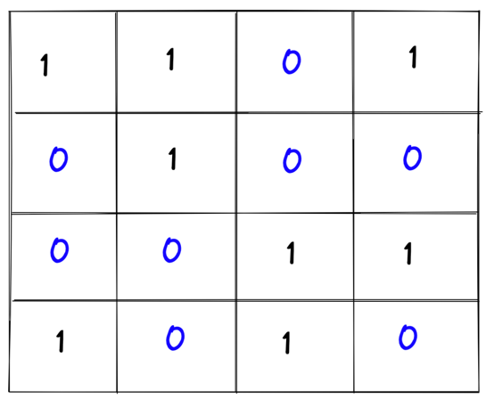
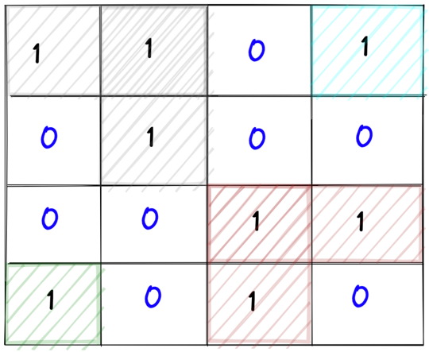
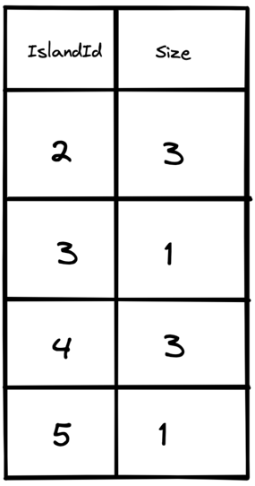
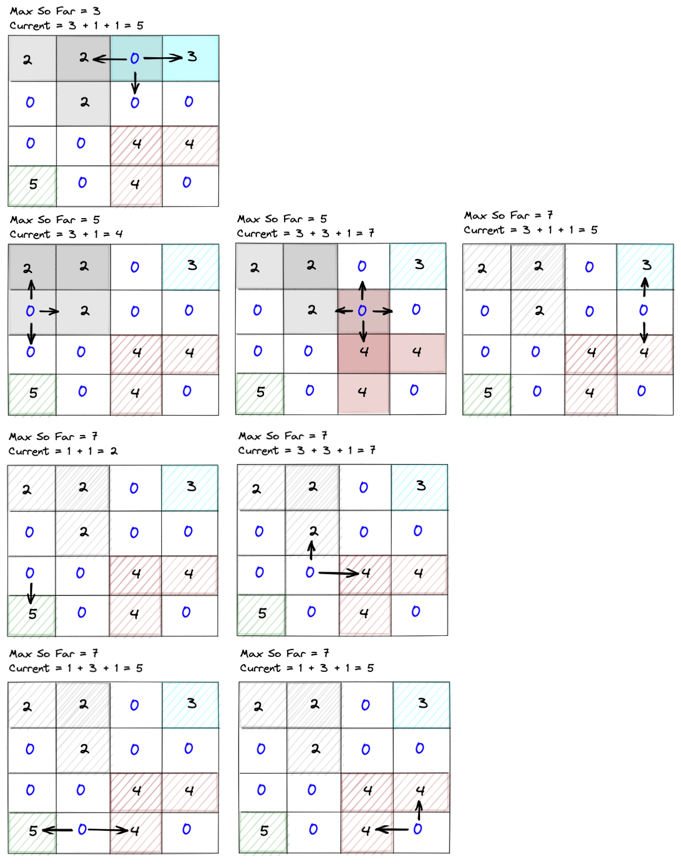

### Problem Statement: 

You are given an n x n binary matrix grid. You are allowed to change at most one 0 to be 1.

Return the size of the largest island in grid after applying this operation.

An island is a 4-directionally connected group of 1s.

Leetcode: https://leetcode.com/problems/making-a-large-island/

Let's assume following is the input grid
   
Here '1' represents the island and '0' represents water.
An island is a 4-directionally connected group of 1s. 
An island is formed when '1s' are connected in either of the four direction (up, down, right, left).

As you can see in the image below, there are 4 different islands

### Steps to solve this problem

1. Iterate over every cell and assign unique ids to each island

2. Find the size of each island and store it in a `HashMap<IslandId, Size>`

3. Find the max island size so far
4. Iterate over every cell of the grid again change '0' to '1' and compute the size of the island

5. If the new computed island size is greater than the best, then make it the new best
6. At the end you will have the answer with the largest island

Refer to the code under leetcode package `bfsdfs` category

